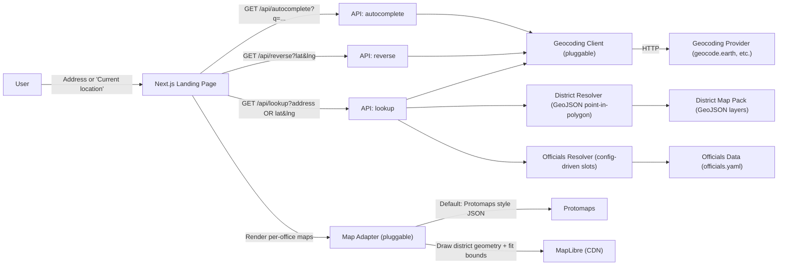

# Legislator Lookup

[](./.github/workflows/ci.yml)
[](./LICENSE)

Headless, self-hostable elected official lookup tool for civic organizations.

Given an address or coordinates, the app:

1. Geocodes to a latitude/longitude.
2. Resolves district IDs by point-in-polygon across configured GeoJSON layers.
3. Returns a list of elected officials for the resolved districts.
4. Optionally returns district shapes so the UI can render per-office district maps.

## Architecture



## Features

- Single-tenant deployment model (one org per instance)
- Pluggable geocoding providers (default: geocode.earth)
- Pluggable map adapters (default: Protomaps + MapLibre)
- Shareable lookup URLs with `?lat=<...>&lng=<...>`
- District resolution from your GeoJSON map pack
- API returns `district_shapes` for map rendering (optional)

## Quick Start

```bash
cd frontend
npm install
npm run dev -p 3011
```

Open `http://localhost:3011`.

## Environment Variables

Do not commit real keys. Use `frontend/.env.example` as a template.

- `GEOCODE_EARTH_API_KEY` (server)
- `NEXT_PUBLIC_PROTOMAPS_API_KEY` (client, Protomaps hosted styles)

## Data And Configuration

- App config: `frontend/src/lib/app-config.ts`
  - `geography.districtMapPack.layers`: GeoJSON district layers + number property config
  - `officials.officeSlots`: which offices to return and how they map to district layers
- District map data: `frontend/data/district-maps/<state-slug>/...`
- Officials data: `frontend/data/officials.yaml`

## API

- `GET /api/lookup?address=<...>` or `GET /api/lookup?lat=<...>&lng=<...>`
- `GET /api/autocomplete?q=<...>`
- `GET /api/reverse?lat=<...>&lng=<...>`
- `GET /api/health`

## Embedding

This repo ships a complete UI, but it is designed to be embedded:

- Host your own instance and iframe the landing page.
- Or call `/api/lookup` from your own frontend and render results.

## License

MIT. See `LICENSE`.

